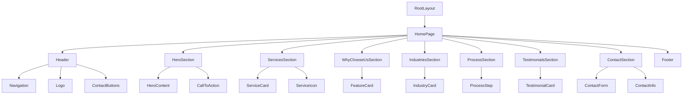

# BK Security Services - Homepage Design Document

## Overview

This document outlines the design and implementation strategy for a professional $500B-worth security company homepage. The design focuses on trust, professionalism, and modern aesthetics using a black, blue, and white color scheme. The implementation leverages Next.js 15, React 19, TypeScript, and shadcn/ui components for a clean, responsive, and user-friendly experience.

## Technology Stack & Dependencies

### Core Framework
- **Next.js 15.5.2** - React framework with App Router
- **React 19.1.0** - UI library with latest features
- **TypeScript 5** - Type safety and development experience

### UI Components & Styling
- **shadcn/ui** - High-quality, accessible component library
- **Radix UI** - Primitive components for complex UI patterns
- **Tailwind CSS 4** - Utility-first CSS framework
- **Lucide React** - Beautiful, customizable icons
- **class-variance-authority** - Component variant management

### Key Features
- **Server-side rendering** for optimal SEO and performance
- **Responsive design** across all device sizes
- **Accessible components** following WCAG guidelines
- **Modern animations** and smooth transitions

## Architecture

### Project Structure
```
src/
├── app/
│   ├── layout.tsx          # Root layout with theme setup
│   ├── page.tsx            # Homepage implementation
│   └── globals.css         # Global styles and custom CSS variables
├── components/
│   ├── ui/                 # shadcn/ui components
│   ├── layout/             # Layout components (Header, Footer, Navigation)
│   ├── sections/           # Homepage sections (Hero, Services, etc.)
│   └── common/             # Reusable utility components
├── hooks/
│   └── use-mobile.ts       # Mobile detection hook
└── lib/
    └── utils.ts            # Utility functions and class merging
```

### Component Hierarchy



## Component Architecture

### Core Layout Components

#### Header Component
- **Sticky navigation** with smooth scroll behavior
- **Logo placement** with company branding
- **Mobile-responsive menu** using Sheet component
- **Contact buttons** prominently displayed
- **Scroll-triggered styling** changes

#### Footer Component
- **Multi-column layout** with organized information
- **Contact details** and emergency numbers
- **Service links** and quick navigation
- **Social media integration** placeholders
- **Legal information** and certifications

### Homepage Sections

#### Hero Section
```typescript
interface HeroSectionProps {
  title: string;
  subtitle: string;
  description: string;
  primaryCTA: {
    text: string;
    action: () => void;
  };
  secondaryCTA: {
    text: string;
    action: () => void;
  };
}
```

**Features:**
- Full-screen hero with background gradient
- Animated text reveals using CSS animations
- Dual call-to-action buttons
- Emergency contact prominence
- Professional imagery integration

#### Services Overview Section
```typescript
interface Service {
  id: string;
  icon: LucideIcon;
  title: string;
  description: string;
  features: string[];
}
```

**Layout:**
- Grid-based responsive layout (1-2-3 columns)
- Card components with hover effects
- Icon integration from Lucide React
- Progressive disclosure of service details

#### Why Choose Us Section
```typescript
interface Feature {
  icon: LucideIcon;
  title: string;
  description: string;
  highlight?: boolean;
}
```

**Implementation:**
- Badge components for key certifications
- Accordion for detailed information
- Progress bars for statistics
- Trust indicators and certifications

#### Industries We Serve Section
```typescript
interface Industry {
  category: string;
  subcategories: string[];
  icon: LucideIcon;
}
```

**Design Pattern:**
- Tabs component for category navigation
- Card grid for subcategories
- Visual icons for quick recognition
- Collapsible content for mobile

#### Process Section
```typescript
interface ProcessStep {
  step: number;
  title: string;
  description: string;
  icon: LucideIcon;
}
```

**Visual Flow:**
- Numbered step progression
- Timeline-style layout for desktop
- Vertical card stack for mobile
- Progressive revelation animations

#### Testimonials Section
```typescript
interface Testimonial {
  id: string;
  content: string;
  author: string;
  role: string;
  rating: number;
}
```

**Features:**
- Carousel component with auto-play
- Star ratings using custom components
- Avatar placeholders with initials
- Responsive slide configuration

#### Contact Section
```typescript
interface ContactFormData {
  name: string;
  email: string;
  phone: string;
  service: string;
  message: string;
  urgency: 'normal' | 'urgent' | 'emergency';
}
```

**Components Used:**
- Form components with validation
- Select dropdowns for service types
- Textarea for detailed messages
- Alert components for form feedback

## Styling Strategy

### Color Palette
```css
:root {
  /* Primary Colors */
  --primary-black: #000000;
  --primary-blue: #1e40af;
  --primary-white: #ffffff;
  
  /* Secondary Colors */
  --blue-50: #eff6ff;
  --blue-100: #dbeafe;
  --blue-500: #3b82f6;
  --blue-600: #2563eb;
  --blue-900: #1e3a8a;
  
  /* Neutral Colors */
  --gray-50: #f9fafb;
  --gray-100: #f3f4f6;
  --gray-600: #4b5563;
  --gray-900: #111827;
}
```

### Typography Scale
```css
/* Headings */
.hero-title: text-4xl md:text-6xl font-bold
.section-title: text-3xl md:text-4xl font-semibold
.card-title: text-xl font-semibold
.body-large: text-lg
.body-default: text-base
.body-small: text-sm

/* Font Families */
--font-primary: 'Geist', sans-serif
--font-mono: 'Geist Mono', monospace
```

### Component Variants
```typescript
// Button variants for security theme
const securityButtonVariants = {
  primary: "bg-blue-600 hover:bg-blue-700 text-white",
  emergency: "bg-red-600 hover:bg-red-700 text-white animate-pulse",
  outline: "border-blue-600 text-blue-600 hover:bg-blue-50",
  ghost: "text-gray-600 hover:bg-gray-100"
}

// Card variants for different sections
const cardVariants = {
  service: "hover:shadow-lg transition-shadow border-l-4 border-l-blue-600",
  feature: "bg-blue-50 border-blue-200",
  testimonial: "bg-white shadow-md"
}
```

### Responsive Design Breakpoints
```css
/* Mobile First Approach */
sm: 640px   /* Small tablets */
md: 768px   /* Tablets */
lg: 1024px  /* Small laptops */
xl: 1280px  /* Desktops */
2xl: 1536px /* Large screens */
```

## State Management

### Component State Patterns
```typescript
// Navigation state
interface NavigationState {
  activeSection: string;
  mobileMenuOpen: boolean;
  scrollPosition: number;
}

// Form state management
interface ContactFormState {
  formData: ContactFormData;
  isSubmitting: boolean;
  errors: Record<string, string>;
  submitStatus: 'idle' | 'success' | 'error';
}

// UI interaction state
interface UIState {
  heroAnimationComplete: boolean;
  visibleSections: Set<string>;
  preferredTheme: 'light' | 'dark';
}
```

### Custom Hooks Implementation
```typescript
// Mobile detection
const useMobile = () => {
  const [isMobile, setIsMobile] = useState(false);
  // Implementation details
}

// Scroll position tracking
const useScrollPosition = () => {
  const [scrollY, setScrollY] = useState(0);
  // Implementation details
}

// Intersection observer for animations
const useIntersectionObserver = (threshold = 0.1) => {
  // Implementation details
}
```

## API Integration Layer

### Contact Form Integration
```typescript
interface ContactAPI {
  submitInquiry: (data: ContactFormData) => Promise<ContactResponse>;
  scheduleConsultation: (data: ConsultationRequest) => Promise<ScheduleResponse>;
  emergencyContact: (data: EmergencyRequest) => Promise<EmergencyResponse>;
}

// Form submission handling
const handleContactSubmit = async (formData: ContactFormData) => {
  try {
    setIsSubmitting(true);
    const response = await contactAPI.submitInquiry(formData);
    setSubmitStatus('success');
    // Handle success
  } catch (error) {
    setSubmitStatus('error');
    // Handle error
  } finally {
    setIsSubmitting(false);
  }
};
```

### Analytics Integration
```typescript
// Event tracking for user interactions
interface AnalyticsEvents {
  'hero_cta_click': { button: string };
  'service_card_click': { service: string };
  'contact_form_submit': { service_type: string };
  'phone_number_click': { source: string };
}
```

## Testing Strategy

### Component Testing Approach
```typescript
// Example test structure
describe('HeroSection', () => {
  it('renders hero content correctly', () => {
    // Test implementation
  });
  
  it('handles CTA button clicks', () => {
    // Test implementation
  });
  
  it('displays emergency contact prominently', () => {
    // Test implementation
  });
});
```

### Testing Priorities
1. **Critical user paths** - Contact form submission, phone number clicks
2. **Responsive behavior** - Mobile menu, card layouts, form responsiveness
3. **Accessibility compliance** - Screen reader support, keyboard navigation
4. **Performance metrics** - Page load times, animation smoothness
5. **Cross-browser compatibility** - Chrome, Firefox, Safari, Edge

### Testing Tools
- **Jest** - Unit testing framework
- **React Testing Library** - Component testing utilities
- **Playwright** - End-to-end testing
- **Lighthouse** - Performance and accessibility auditing

## Performance Optimization

### Next.js Optimizations
```typescript
// Image optimization
import Image from 'next/image'

// Font optimization
import { Geist } from 'next/font/google'
const geist = Geist({ subsets: ['latin'] })

// Metadata optimization
export const metadata: Metadata = {
  title: 'BK Security Services - Professional Security Solutions',
  description: 'Trusted security services including armed guards, bodyguards, and 24/7 monitoring.',
  openGraph: {
    title: 'BK Security Services',
    description: 'Professional security solutions you can trust',
  }
}
```

### Loading Strategy
1. **Critical path optimization** - Above-the-fold content prioritization
2. **Progressive loading** - Lazy loading for below-the-fold sections
3. **Image optimization** - WebP format, responsive sizing
4. **Code splitting** - Component-level lazy loading
5. **Caching strategy** - Static generation for content sections

### Performance Targets
- **First Contentful Paint** < 1.5s
- **Largest Contentful Paint** < 2.5s
- **Cumulative Layout Shift** < 0.1
- **Time to Interactive** < 3.5s
- **Lighthouse Score** > 90 (Performance, Accessibility, Best Practices, SEO)

## Accessibility Implementation

### WCAG 2.1 AA Compliance
```typescript
// Semantic HTML structure
const HeroSection = () => (
  <section aria-labelledby="hero-title" role="banner">
    <h1 id="hero-title">Professional Security Services You Can Trust</h1>
    <p aria-describedby="hero-description">
      Protecting What Matters Most to You
    </p>
  </section>
)

// Keyboard navigation support
const Navigation = () => {
  const handleKeyDown = (event: KeyboardEvent) => {
    if (event.key === 'Enter' || event.key === ' ') {
      // Handle activation
    }
  }
}
```

### Focus Management
- **Logical tab order** throughout all interactive elements
- **Focus indicators** clearly visible on all focusable elements
- **Skip links** for keyboard users to bypass navigation
- **Focus trapping** in modal dialogs and mobile menus

### Screen Reader Support
- **Alt text** for all images and icons
- **ARIA labels** for complex interactions
- **Landmark roles** for page structure
- **Live regions** for dynamic content updates

## Security Considerations

### Frontend Security Measures
```typescript
// Input sanitization
const sanitizeInput = (input: string): string => {
  return input.replace(/<script\b[^<]*(?:(?!<\/script>)<[^<]*)*<\/script>/gi, '');
}

// Form validation
const validateContactForm = (data: ContactFormData): ValidationResult => {
  const errors: Record<string, string> = {};
  
  if (!data.email.match(/^[^\s@]+@[^\s@]+\.[^\s@]+$/)) {
    errors.email = 'Please enter a valid email address';
  }
  
  if (!data.phone.match(/^\+?[\d\s\-\(\)]+$/)) {
    errors.phone = 'Please enter a valid phone number';
  }
  
  return { isValid: Object.keys(errors).length === 0, errors };
}
```

### Content Security Policy
```typescript
// Next.js security headers
const securityHeaders = [
  {
    key: 'Content-Security-Policy',
    value: "default-src 'self'; script-src 'self' 'unsafe-eval'; style-src 'self' 'unsafe-inline';"
  },
  {
    key: 'X-Frame-Options',
    value: 'DENY'
  }
]
```

## Deployment & Hosting

### Build Configuration
```typescript
// next.config.ts
const nextConfig = {
  output: 'standalone',
  images: {
    domains: ['security-assets.example.com'],
    formats: ['image/webp', 'image/avif']
  },
  compiler: {
    removeConsole: process.env.NODE_ENV === 'production'
  }
}
```

### Environment Configuration
```typescript
// Environment variables
interface EnvironmentConfig {
  NEXT_PUBLIC_CONTACT_API_URL: string;
  NEXT_PUBLIC_ANALYTICS_ID: string;
  CONTACT_FORM_WEBHOOK_URL: string;
  EMERGENCY_NOTIFICATION_ENDPOINT: string;
}
```

### Performance Monitoring
- **Core Web Vitals** tracking
- **Error boundary** implementation
- **Analytics integration** for user behavior
- **A/B testing** setup for conversion optimization

This design document provides a comprehensive foundation for implementing a professional, secure, and user-friendly homepage for BK Security Services, leveraging modern web technologies and best practices for optimal user experience and business conversion.